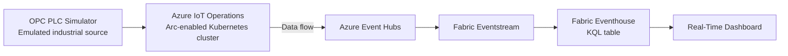

# Azure IoT Operations Lab: Edge Simulator to Fabric Real-Time Intelligence

This lab uses Azure IoT Operations, not Azure IoT Hub.

The goal is to show how signals from an emulated industrial device can flow through Azure IoT Operations and then be consumed in Microsoft Fabric Real-Time Intelligence.

## Lab Flow

1. Deploy Azure IoT Operations to an Arc-enabled Kubernetes cluster.
2. Run the OPC PLC simulator as the emulated device source.
3. Configure assets and data flows in Azure IoT Operations.
4. Route processed signals to Azure Event Hubs.
5. Consume the Event Hubs stream in Microsoft Fabric Eventstream.
6. Land the events in Eventhouse and analyze them with KQL.

## Key Point

For this lab, Fabric RTI does not connect directly to Azure IoT Operations.

The supported quickstart path is:

`OPC PLC simulator -> Azure IoT Operations -> Azure Event Hubs -> Fabric Eventstream -> Eventhouse -> Dashboard`

That Event Hubs hop is important. It is the cloud handoff layer between Azure IoT Operations and Fabric RTI in this scenario.

## What You Learn

- What Azure IoT Operations does at the edge
- How an industrial simulator is represented as an asset
- How Azure IoT Operations data flows transform and route telemetry
- How Fabric RTI consumes the resulting cloud stream
- How this differs from a simple IoT Hub lab

## Target Architecture



## Runtime Options For This Lab

This lab was originally written for GitHub Codespaces, but you can run it on your own Azure VM (IaaS) with the same Azure IoT Operations and Fabric flow.

Recommended when Codespaces quota is exhausted:

- Azure Ubuntu VM + VS Code Remote SSH (Option 1)

Still supported:

- GitHub Codespaces (official quickstart path)

## Why Codespaces Was Used Initially

Azure IoT Operations runs on Kubernetes and has more moving parts than an IoT Hub-only lab.

To reduce setup friction, this lab follows the official Microsoft quickstart path that uses:

- GitHub Codespaces
- K3s in K3d
- Azure Arc
- Azure IoT Operations CLI
- OPC PLC simulator

This gives you a realistic Azure IoT Operations environment without first building your own AKS or local Linux cluster.

With an Azure VM, you get a similar experience while controlling cost and uptime yourself.

## Prerequisites

### Azure

- An Azure subscription
- Permission to create resource groups and role assignments
- Permission to register Azure resource providers

### Local Tools

- Visual Studio Code installed locally
- Remote - SSH extension in VS Code
- Azure CLI available either locally or in Azure Cloud Shell (for VM provisioning)

### Optional

- A GitHub account (only needed if you still want to use Codespaces)
- GitHub Codespaces extension in VS Code

### Fabric

- A Microsoft Fabric subscription or Fabric trial
- A Fabric workspace with Contributor or higher permissions
- Real-time dashboard creation enabled in the tenant if you want the dashboard step

## Cost Notes

- Azure IoT Operations is not a lightweight free-tier service like IoT Hub F1
- Codespaces is suitable for exploration, not for production or scale testing
- For Azure VM usage, stop or deallocate the VM when not in use
- Clean up the Azure resource group, Fabric items, and your host environment (Codespace or VM) after the lab

## End State

At the end of the lab, you should have:

- An Azure IoT Operations instance running on a K3s cluster hosted in Codespaces or your Azure VM
- An OPC PLC simulator producing emulated operational data
- Azure IoT Operations assets and data flows configured from the sample deployment
- An Azure Event Hubs namespace receiving the processed signals
- A Fabric Eventstream and Eventhouse showing the same signals in RTI

## Step 1: Prepare A Host Environment

Choose one host environment for the Kubernetes and Azure IoT Operations setup.

### Option 1 (Recommended): Azure VM (IaaS) + VS Code Remote SSH

Create a small Ubuntu VM (for example, Standard_B2s), then connect from VS Code.

Example VM creation (run locally or in Azure Cloud Shell):

```bash
export SUBSCRIPTION_ID=<subscription-id>
export RESOURCE_GROUP=<resource-group>
export LOCATION=<azure-region>
export VM_NAME=<vm-name>
export ADMIN_USERNAME=<admin-username>

az account set --subscription $SUBSCRIPTION_ID
az group create --name $RESOURCE_GROUP --location $LOCATION
az vm create \
    --resource-group $RESOURCE_GROUP \
    --name $VM_NAME \
    --image Ubuntu2204 \
    --size Standard_B2s \
    --admin-username $ADMIN_USERNAME \
    --generate-ssh-keys
```

Connect:

```bash
ssh $ADMIN_USERNAME@<public-ip>
```

Install base tooling on the VM:

```bash
sudo apt-get update
sudo apt-get install -y ca-certificates curl gnupg lsb-release apt-transport-https git unzip jq

# Docker
curl -fsSL https://download.docker.com/linux/ubuntu/gpg | sudo gpg --dearmor -o /usr/share/keyrings/docker.gpg
echo "deb [arch=$(dpkg --print-architecture) signed-by=/usr/share/keyrings/docker.gpg] https://download.docker.com/linux/ubuntu $(lsb_release -cs) stable" | sudo tee /etc/apt/sources.list.d/docker.list > /dev/null
sudo apt-get update
sudo apt-get install -y docker-ce docker-ce-cli containerd.io docker-buildx-plugin docker-compose-plugin
sudo usermod -aG docker $USER

# kubectl
curl -LO "https://dl.k8s.io/release/$(curl -L -s https://dl.k8s.io/release/stable.txt)/bin/linux/amd64/kubectl"
sudo install -o root -g root -m 0755 kubectl /usr/local/bin/kubectl
rm kubectl

# k3d
curl -s https://raw.githubusercontent.com/k3d-io/k3d/main/install.sh | bash

# Azure CLI
curl -sL https://aka.ms/InstallAzureCLIDeb | sudo bash
```

Start a fresh shell (or sign out/in) after adding your user to the Docker group.

Create the local K3s-in-k3d cluster used by the lab:

```bash
export CLUSTER_NAME=<cluster-name>
k3d cluster create $CLUSTER_NAME
kubectl get nodes
```

Then continue with Step 2 and run all remaining commands from your VM terminal.

### Option 2: GitHub Codespaces (Original Quickstart)

Use the official Microsoft sample Codespace:

- https://codespaces.new/Azure-Samples/explore-iot-operations?quickstart=1

When prompted, define these Codespaces secrets:

- `SUBSCRIPTION_ID`
- `RESOURCE_GROUP`
- `LOCATION`

The Codespace also sets `CLUSTER_NAME` automatically.

Then open the Codespace in VS Code Desktop.

## Step 2: Sign In and Register Azure Providers

Run these commands in your host terminal (Azure VM terminal or Codespace terminal).

```bash
az login

az provider register -n "Microsoft.ExtendedLocation"
az provider register -n "Microsoft.Kubernetes"
az provider register -n "Microsoft.KubernetesConfiguration"
az provider register -n "Microsoft.IoTOperations"
az provider register -n "Microsoft.DeviceRegistry"
az provider register -n "Microsoft.SecretSyncController"
```

Create the resource group:

```bash
az group create --location $LOCATION --resource-group $RESOURCE_GROUP
```

## Step 3: Arc-Enable the Cluster

Connect the K3s cluster to Azure Arc:

```bash
az connectedk8s connect --name $CLUSTER_NAME --location $LOCATION --resource-group $RESOURCE_GROUP
```

Get the Arc service principal object ID:

```bash
export OBJECT_ID=$(az ad sp show --id bc313c14-388c-4e7d-a58e-70017303ee3b --query id -o tsv)
```

Enable cluster features required by Azure IoT Operations:

```bash
az connectedk8s enable-features -n $CLUSTER_NAME -g $RESOURCE_GROUP --custom-locations-oid $OBJECT_ID --features cluster-connect custom-locations
```

## Step 4: Install the Azure IoT Operations CLI Extension

```bash
az extension add --upgrade --name azure-iot-ops
```

## Step 5: Create the Schema Registry and Device Registry Namespace

Set names for the storage account and schema registry:

```bash
export STORAGE_ACCOUNT=<storageaccountname>
export SCHEMA_REGISTRY=<schemaregistryname>
export SCHEMA_REGISTRY_NAMESPACE=<schemaregistrynamespace>
```

Create the storage account:

```bash
az storage account create --name $STORAGE_ACCOUNT --location $LOCATION --resource-group $RESOURCE_GROUP --enable-hierarchical-namespace
```

Create the schema registry:

```bash
az iot ops schema registry create --name $SCHEMA_REGISTRY --resource-group $RESOURCE_GROUP --registry-namespace $SCHEMA_REGISTRY_NAMESPACE --sa-resource-id $(az storage account show --name $STORAGE_ACCOUNT -o tsv --query id)
```

Create the Azure Device Registry namespace:

```bash
az iot ops ns create -n myqsnamespace -g $RESOURCE_GROUP
```

## Step 6: Deploy Azure IoT Operations

Initialize the cluster:

```bash
az iot ops init --cluster $CLUSTER_NAME --resource-group $RESOURCE_GROUP
```

Deploy Azure IoT Operations:

```bash
az iot ops create --cluster $CLUSTER_NAME --resource-group $RESOURCE_GROUP --name ${CLUSTER_NAME}-instance --sr-resource-id $(az iot ops schema registry show --name $SCHEMA_REGISTRY --resource-group $RESOURCE_GROUP -o tsv --query id) --ns-resource-id $(az iot ops ns show --name myqsnamespace --resource-group $RESOURCE_GROUP -o tsv --query id) --broker-frontend-replicas 1 --broker-frontend-workers 1 --broker-backend-part 1 --broker-backend-workers 1 --broker-backend-rf 2 --broker-mem-profile Low
```

Check the deployment:

```bash
kubectl get pods -n azure-iot-operations
```

## Step 7: Deploy the Emulated Device Source

For Azure IoT Operations, the emulated source is the OPC PLC simulator.

Deploy it into the cluster:

```bash
kubectl apply -f https://raw.githubusercontent.com/Azure-Samples/explore-iot-operations/main/samples/quickstarts/opc-plc-deployment.yaml
```

This simulator acts as an industrial OPC UA source. In the official sample, it represents an oven in a bakery scenario.

## Step 8: Configure Assets, Data Flows, and Event Hubs

Download the official quickstart Bicep file:

```bash
wget https://raw.githubusercontent.com/Azure-Samples/explore-iot-operations/main/samples/quickstarts/quickstart.bicep -O quickstart.bicep
```

Collect the Azure IoT Operations instance values:

```bash
export AIO_EXTENSION_NAME=$(az k8s-extension list -g $RESOURCE_GROUP --cluster-name $CLUSTER_NAME --cluster-type connectedClusters --query "[?extensionType == 'microsoft.iotoperations'].id" -o tsv | awk -F'/' '{print $NF}')
export AIO_INSTANCE_NAME=$(az iot ops list -g $RESOURCE_GROUP --query "[0].name" -o tsv)
export CUSTOM_LOCATION_NAME=$(az iot ops list -g $RESOURCE_GROUP --query "[0].extendedLocation.name" -o tsv | awk -F'/' '{print $NF}')
```

Apply the Bicep deployment:

```bash
az deployment group create --subscription $SUBSCRIPTION_ID --resource-group $RESOURCE_GROUP --template-file quickstart.bicep --parameters clusterName=$CLUSTER_NAME customLocationName=$CUSTOM_LOCATION_NAME aioExtensionName=$AIO_EXTENSION_NAME aioInstanceName=$AIO_INSTANCE_NAME aioNamespaceName=myqsnamespace
```

What this deployment gives you:

- A device connection to the OPC PLC simulator
- An asset representing the simulated oven
- Data flows that reshape and enrich the messages
- An Azure Event Hubs namespace and hub as the cloud destination

## Step 9: Verify That Azure IoT Operations Is Sending Data to Event Hubs

In the Azure portal:

1. Open the resource group
2. Find the Event Hubs namespace created by the Bicep deployment
3. Open the namespace overview
4. Confirm that incoming messages are increasing
5. Optionally inspect messages with Event Hubs Data Explorer

If you cannot read messages in Data Explorer, you might need the `Azure Event Hubs Data Receiver` role.

## Step 10: Create the Fabric RTI Ingestion Path

In Fabric:

1. Create an `Eventstream`
2. Add `Azure Event Hubs` as the source
3. Use the Event Hubs namespace and hub created by the Azure IoT Operations quickstart
4. Use `RootManageSharedAccessKey`
5. Use consumer group `$Default`
6. Set data format to `Json`
7. Open the Eventstream and confirm the live preview shows simulator data

This is the key difference from the old repo version: Fabric reads from Event Hubs, not from IoT Hub.

## Step 11: Create the Eventhouse and KQL Table

In Fabric:

1. Create a new `Eventhouse` named `aio-lab-eh`
2. In the default KQL database, create a table named `OPCUA` with this schema:

| Column      | Type     |
| ----------- | -------- |
| AssetId     | string   |
| Spike       | bool     |
| Temperature | decimal  |
| FillWeight  | decimal  |
| EnergyUse   | decimal  |
| Timestamp   | datetime |

Create the JSON ingestion mapping:

```kusto
.create table ['OPCUA'] ingestion json mapping 'opcua_mapping' '[{"column":"AssetId", "Properties":{"Path":"$[\'AssetId\']"}},{"column":"Spike", "Properties":{"Path":"$.Spike"}},{"column":"Temperature", "Properties":{"Path":"$.TemperatureF"}},{"column":"FillWeight", "Properties":{"Path":"$.FillWeight"}},{"column":"EnergyUse", "Properties":{"Path":"$.EnergyUse.Value"}},{"column":"Timestamp", "Properties":{"Path":"$[\'EventProcessedUtcTime\']"}}]'
```

## Step 12: Send the Eventstream to Eventhouse

Use Fabric `Get data from Eventstream` or add the Eventstream as a source to the `OPCUA` table.

Use these settings:

- Source: your Eventstream
- Destination table: `OPCUA`
- Mapping: `opcua_mapping`

After a short delay, the KQL table should begin filling with the simulator data.

## Step 13: Validate the Signals in KQL

Run a basic query:

```kusto
OPCUA
| sort by Timestamp desc
| take 20
```

Run a simple aggregation:

```kusto
OPCUA
| where Timestamp > ago(30m)
| summarize avgTemp = avg(Temperature), spikes = countif(Spike == true) by bin(Timestamp, 1m), AssetId
| order by Timestamp asc
```

## Step 14: Optional Real-Time Dashboard

You can follow the official quickstart dashboard path:

1. Create a new real-time dashboard
2. Download the sample dashboard template from the Azure-Samples repository
3. Replace the dashboard with the template file
4. Point the template data source at your Eventhouse or KQL database

This gives you a ready-made visual layer for the simulated oven data.

## What Makes This an Azure IoT Operations Lab

This lab now demonstrates Azure IoT Operations specifically because it includes:

- Arc-enabled Kubernetes deployment
- Edge MQTT and data services runtime
- OPC UA simulator integration
- Asset modeling
- Data flows managed by Azure IoT Operations
- Cloud egress to Event Hubs before Fabric RTI consumption

That is fundamentally different from an IoT Hub lab, where a device typically connects directly to Azure.

## Troubleshooting

### Azure IoT Operations deployment fails

- Re-run `az login` interactively
- Confirm the providers were registered
- Confirm your account can create role assignments

### OPC simulator is running but no data reaches Event Hubs

- Check that the Bicep deployment completed successfully
- Check the Azure IoT Operations instance in the operations experience UI
- Check the Event Hubs namespace incoming message count

### Eventstream shows no data

- Confirm Event Hubs is receiving messages first
- Confirm the shared access key is valid
- Confirm the event hub and namespace names are correct
- Confirm the Fabric Eventstream was saved and opened in live view

### KQL table stays empty

- Confirm the `opcua_mapping` mapping exists
- Confirm the mapping paths match the JSON payload
- Refresh the table preview after a few minutes

## Cleanup

If you want to remove Azure IoT Operations but keep the cluster:

```bash
az iot ops delete --cluster $CLUSTER_NAME --resource-group $RESOURCE_GROUP
```

If you want to remove everything:

- If you used Codespaces: delete the Codespace
- If you used Azure VM: deallocate or delete the VM
- Delete the Azure resource group
- Delete the Fabric Eventstream, Eventhouse, and dashboard

## Suggested Next Iterations

1. Replace the OPC PLC simulator with a custom MQTT publisher
2. Build your own Azure IoT Operations data flow instead of using the sample Bicep deployment
3. Route selected data to Fabric OneLake as a second destination
4. Add alerting and anomaly detection in Fabric
5. Compare this lab with a separate IoT Hub lab to see where edge and cloud responsibilities diverge
